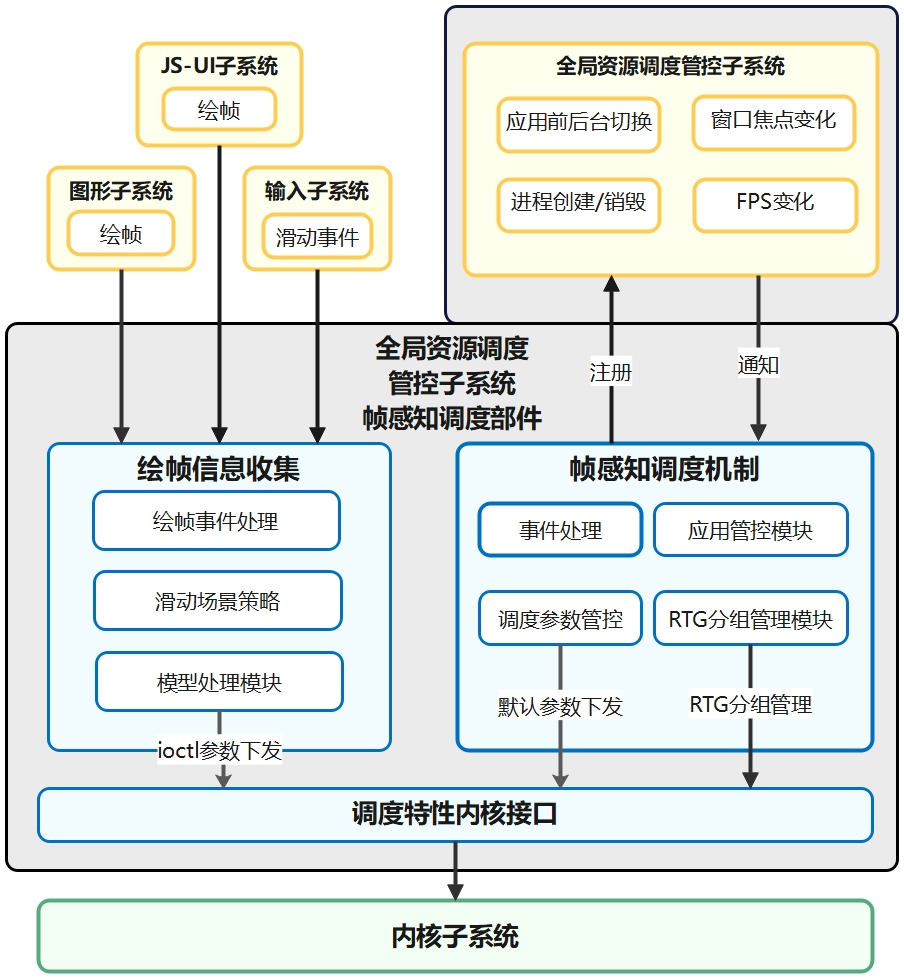

# The Part of Frame Aware Sched

-   [ Introduction](#section_introduction)
-   [ Directory Structure](#section_catalogue)
-   [Framework](#section_framework)
    -   [The component of Frame Information Collection ](#section_collection)
    -   [The component of Frame Aware Policy](#section_policy)
-   [ Usage Guidelines](#section_usage)
-   [ Repositories Involved](#section_projects)

##  Introduction<a name="section_introduction"></a>

The part of Frame Aware Sched belongs to subsystem named *Resource Schedule Subsystem*. 

In order to ensure the cpu scheduling supply, it updates the process scheduling groups and adjust the kernel schedule parameters to influence the kernel scheduling behavior according to the information of the application frame drawing and the application life cycle status.

##  Directory Structure<a name="section_catalogue"></a>

```
//foundation/resourceschedule/frame_aware_sched
├── common           						# 部件通用工具类
│   └── include
│       ├── frame_info_const.h				# 绘帧过程信息
│       ├── frame_aware_constants.h	        # 通用参数配置
│       ├── frame_aware_log_domain.h	    # 封装hilog，用于日志打印
│       └── single_instance.h				# 封装了单例模式的类模板
│
├── interfaces
│   └── innerkits    						# 对内接口目录
│
├── frameworks                              
│   └── core
│	    ├── frame_aware_collector           # 应用绘帧信息收集组件
│       └── frame_aware_policy              # 帧感知调度机制组件
│		
├── profiles       						    # 组件配置文件
└── test 									# 自测试用例目录
```
## Framework<a name="section_framework"></a>

According to the thread it belongs to during execution, the *Farme Aware Sched* is devided into two parts, which are *Frame Aware Collector* and *Frame Aware Policy*. The framework is shown in the following picture.

- *Frame Aware Collector*: which is the core strategy of drawing frames, including frame event processing module, slide scene strategy module, and model processing module.

  Module-frame event processing : responsible for coordinating and dispatching the message information of the frame drawing sub-process of the JS-UI subsystem and the Graphic subsystem.

  Module-slide scene strategy: responsible for the sliding scene recognize and provide the scenario-based fine scheduling by the interface of the model processing module.

  Module-model processing module: responsible for providing the adjustment and scheduling algorithm of each sub-process.

- *Frame Aware Policy*: which is consists of four part: event processing module, application management module, and RTG (Related-Thread-Group) management module and scheduling parameter control module.

  Module-Application state event processing: which is responsible for registering and receiving messages from the global resource management and control subsystem, such as application state switch, window focus state change, etc, and distributing messages to the application management and control module and RTG grouping module.

  Module-Application management: responsible for the unified management of the application messages of the event processing module.

  Module-RTG Managerment: the kernel interface set, sets the RTG accoding to the application state to realize thread scheduling management.

  Module-Scheduling Parameter Control:responsible for reading the default scheduling prameter configuration.



### The component of Frame Information Collection<a name="section_collection"></a>

The *frame information collection* is mainly responsible for adjusting the parameters of kernel scheduling and scaling the thread load. When the user slides on the application, it recognizes the key threads (such as draw frame thread and render thread) ,  perceives the sub-process of the application frame drawing, and adjust the kernel scheduling parameters according to the task timeout status to perform real-time resources. 

- According to the screen refresh rate, it analyze the current frame rate information.  The resource supply of key threads is increased according to the time to end of the drawing frame.
- Adjust resource supply according to the duration of each sub-process during graphics rendering process.
- Adjust resource supply for frame sub-process  task with high frame loss rate.

### The component of Frame Aware Policy<a name="section_Policy"></a>

As the basis for the realization of application frame perception, the *frame aware policy* is mainly reposible for controlling thread groups and thread priorities, realizing the unified management of application threads and ensuring the performance of the entire system.

###  Usage Guidelines<a name="section_usage"></a>

System developers can add or remove this part by configuring the product definition JSON file under **/productdefine/common/products** to enable or disable this part:

` "resourceschedule:frame_aware_sched":{} `

##  Repositories Involved<a name="section_projects"></a>

- [resource_schedule_service](https://gitee.com/openharmony/resourceschedule_resource_schedule_service)
- [ace_ace_engine]( https://gitee.com/openharmony/ace_ace_engine)
- [graphic_graphic_2d](https://gitee.com/openharmony/graphic_graphic_2d)
- [aafwk_standard](https://gitee.com/openharmony/aafwk_standard ) 
- **frame_aware_sched**


